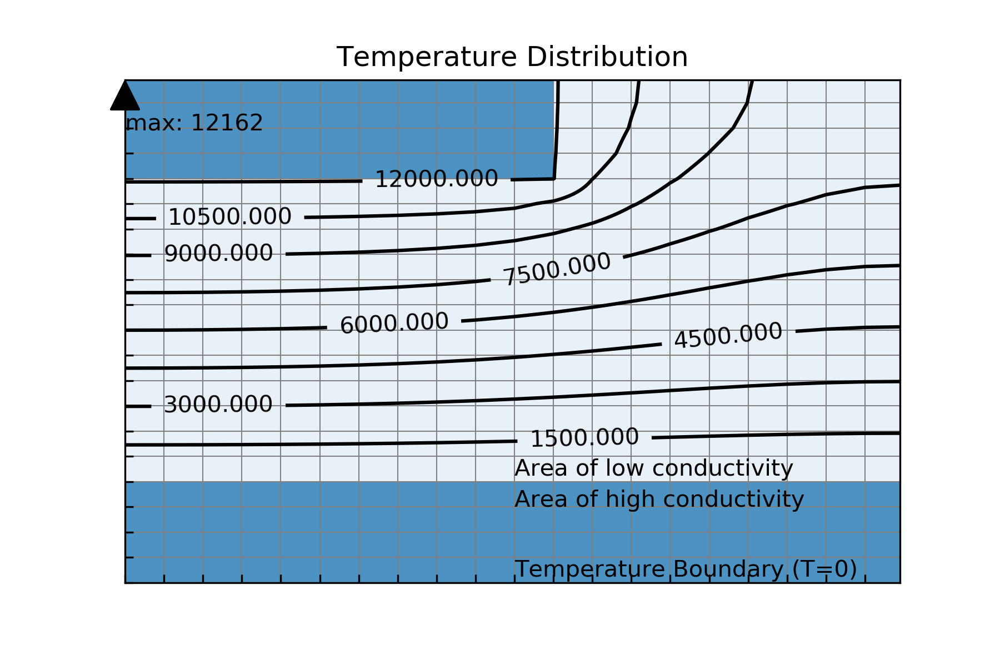

# The Finite Element Method: Examples with a Timoshenko Beam and Poisson's Equation

This project is a small example of coding the finite element method. The first 
coded example is to determine the modal frequencies of a Timoshenko cantilever.
The second solves Poisson's equation which models many physical phenomena. 

## Timoshenko Beam

The finite element method for a Timoshenko beam derives a mass and stiffness
matrix which governs the behaviour of the beam. With no applied force there
is a non-trival solution found from an eigenvalue problem. The coded example
determines the first 5 modal frequencies of the beam from the eigenvalue 
problem and compares them with the theoretical modal frequencies of an 
Euler-Bernoulli beam.

## Poisson's Equation

Poisson's equation results from modeling in many physcial domains including
heat conduction and electrostatics. The example coded in `poisson_fem.py` is 
used to determine the temperature field `T(x,y)` resulting from a set of 
heat sources `Q(x,y)` on a rectangular structure with varying heat conductivity
`k(x,y)`.

The coded example determines the temperature field over a rectangular domain 
due to presence of heat sources in high conductivity areas seperated by
insulating areas. The solution is shown below.

Three different approaches to assembling are explored. By far the worst is
creating a block diagonal sparse matrix and then applying constraints. The
standard iterative method has good performance. However, an approach building
the contents of the sparse matrix using vector operations was the fastest.

## References

Matlab Codes for Finite Element Analysis; A. J. M. Ferreira; 2009; Springer;

Effecient topology optimization in MATLAB using 88 lines of code;
    Erik Andreassen, Anders Clausen, Mattias Schevenels, Boyan S. Lazarov,
    Ole Sigmund; Structural and Multidisciplinary Optimization; January 
    2011; Volume 43, Issue 1, pp 1–16;

The Finite Element Method for Electromagnetic Modelling; Gerard Meunier; 2008;
    Wiley;